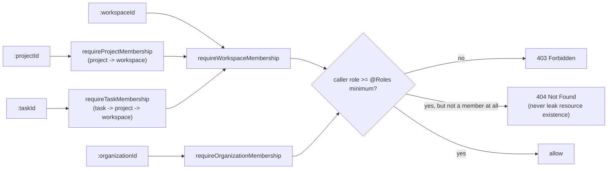
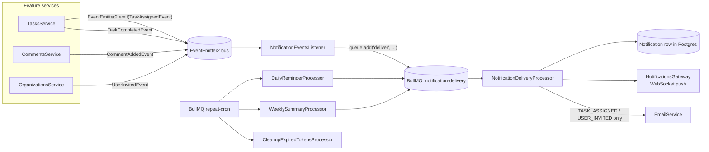

# Architecture

## Module map

Clean Architecture, module-per-domain. Controllers hold no business logic — they validate input (DTO + global `ValidationPipe`) and delegate to a service; services own business rules and talk to Prisma.

```
src/
  common/
    guards/           # JwtAuthGuard (global), RolesGuard (route-scoped RBAC)
    decorators/        # @Public, @CurrentUser, @Roles, @AuditLog
    access/            # WorkspaceAccessService - single source of truth for
                        # membership resolution (workspace/org/project/task -> role)
    interceptors/      # TransformInterceptor, LoggingInterceptor, AuditLogInterceptor
    filters/            # GlobalExceptionFilter
    events/             # domain event classes (TaskAssigned, TaskCompleted, CommentAdded, UserInvited)
  config/               # typed configuration loader
  prisma/               # PrismaService, global module
  redis/                # CacheService (dashboard/profile/workspace-stats caching)
  auth/                 # register, login, refresh rotation, logout, password reset
  users/                 # profile, lookup, cached personal dashboard
  organizations/         # org CRUD + membership
  workspaces/             # workspace CRUD + membership + cached stats
  projects/                # project CRUD, search, pagination
  tasks/                    # task CRUD, status workflow, pagination/sort/filter
  comments/                  # own-comment edit/delete
  attachments/                # upload/download, size+MIME validation, storage abstraction
  storage/                     # StorageService interface + local-disk implementation
  notifications/                # notification read-model + WebSocket gateway
  queue/                         # BullMQ: event listener, delivery/reminder/summary/cleanup processors
  email/                         # EmailService (SMTP)
  health/                        # liveness/readiness check (Postgres, Redis, memory) via @nestjs/terminus
```

## Request-time RBAC

`JwtAuthGuard` is global (`APP_GUARD`) — every route needs a valid access token unless marked `@Public()`. Authorization is layered on top by `RolesGuard` + `@Roles(...)`, which resolves the caller's role from whichever route param identifies the resource and walks the join chain via `WorkspaceAccessService` when the resource isn't a workspace itself:



Endpoints that only need *membership* (not a minimum role above `VIEWER`) — most `GET`s, and "edit/delete your own comment" — skip `@Roles` entirely and rely on the same `WorkspaceAccessService` calls made directly in the service layer, since those already need the joined entity (task/project) for business logic anyway. Mixed rules that can't be expressed as a single minimum role (e.g. attachment delete: "uploader OR ADMIN+") stay as explicit service-layer checks by design — see [`adr/0001-rbac-strategy.md`](adr/0001-rbac-strategy.md).

## Event-driven notifications

Feature code never calls the notification pipeline directly — it emits a domain event and moves on. This decouples "a task got assigned" from "how that fact reaches a user" (in-app push, email, or both), and means new delivery channels don't require touching `TasksService`/`CommentsService`/etc.



`NotificationDeliveryProcessor` is the single place that turns a job into (a) a persisted `Notification` row, (b) a WebSocket push to whichever browser tabs that user has open, and (c) an email for the two types where email actually matters (`TASK_ASSIGNED`, `USER_INVITED` — not every comment, to avoid spam). Failed jobs retry via BullMQ's built-in backoff rather than being dropped.

## Caching

`CacheService` (Redis) wraps three read paths that are expensive relative to how often their underlying data changes: a user's personal dashboard, a user's profile, and per-workspace stats (member/project counts, tasks by status). Each write path that can invalidate one of these (task create/update/delete, project archive/restore, member changes) explicitly calls `cache.del(...)` for the affected key — there's no blanket TTL-only strategy, because a stale task-assignment count is a worse UX bug than a cache miss.

## Error & response shape

- Every error is normalized by `GlobalExceptionFilter`: `{ success: false, statusCode, path, timestamp, message, error? }`.
- Every success response is wrapped by `TransformInterceptor`: `{ success: true, statusCode, data }`.
- Every mutating route decorated `@AuditLog(...)` is captured by the global `AuditLogInterceptor`, writing `{ userId, action, entityType, entityId, previousValue, newValue }` to `AuditLog` after the handler resolves.
