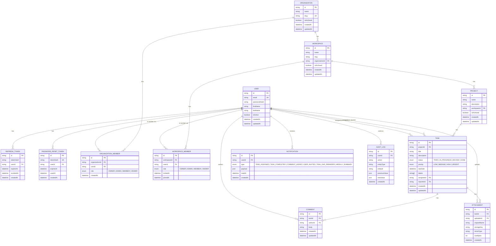

# ER Diagram

Generated from [`prisma/schema.prisma`](../prisma/schema.prisma). Renders natively on GitHub and in any Mermaid-aware Markdown viewer.

## Notes

- **Organization vs. workspace roles are independent.** `OrganizationMember.role` and `WorkspaceMember.role` both use the same `WorkspaceRole` enum (`OWNER > ADMIN > MEMBER > VIEWER`) but are separate rows — a user's role in an organization does not determine their role in any specific workspace inside it.
- **Tasks/comments/attachments carry no `workspaceId` of their own.** Workspace membership for these is resolved by joining up the chain (`task -> project -> workspace`), centralized in `WorkspaceAccessService` (see [`ARCHITECTURE.md`](ARCHITECTURE.md)) rather than duplicated per-entity.
- **`AuditLog` is generic**, not one table per entity — `entityType` + `entityId` identify what changed, `previousValue`/`newValue` hold the before/after snapshot as JSON, satisfying requirement §15 (Audit Logs) without a table explosion.
- **Soft-delete is partial today**: `Organization`, `Workspace`, and `Project` carry `isArchived` (reversible archive, not deletion); `Task`/`Comment`/`Attachment` are hard-deleted. A true `deletedAt` column on every entity is a tracked gap, not yet implemented.
