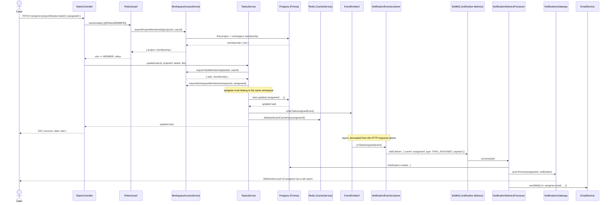

# Sequence Diagram: Assigning a Task

Chosen because it exercises most of the architecture in one request: RBAC resolution through a join chain, an event emitted rather than a direct call, an async queue hop, cache invalidation, and two delivery channels (WebSocket + email).

Key property: the HTTP response at step "200 { success, data: task }" does **not** wait on notification delivery — the event emission is synchronous but the queue job runs in a separate worker context, so a slow email provider or a Redis hiccup never adds latency to the task-update request itself.
